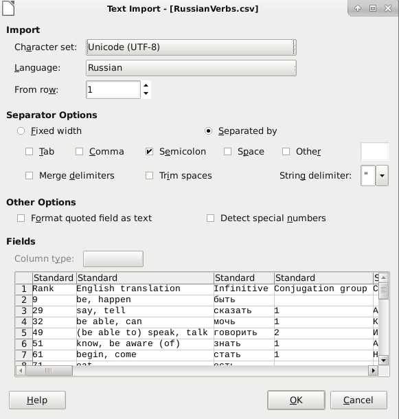
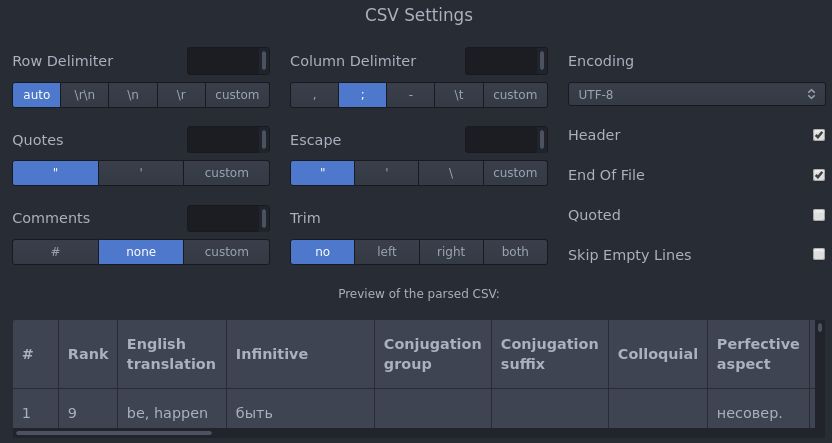

# Russian-Verbs-Classification

Purpose of the repository is to share knowledge and efforts to build a database about the the most frequent Russian Verbs which are the most useful for any russian language learners.

This database can be used for the study of russian verbs: to study verbs forms, to learn conjugation, to build cheat-sheets...

Once opened with a CSV Editor (Excel or an open-source alternative) it becomes easy to filter and display only the wanted verbs.

## Structure

The main file is called `RussianVerbs.csv` and contains for each verb:

* Conjugation
  * Conjugation of the present present (if imperfective) else the future tense.
  * Conjugation of imperatives
  * Conjugation of verbal adjectives and verbal adverbs

* Translation
  * In english for now

* Metadata
  * Aspect pairs (imperative / perfective)
  * Ranks in the russian language, as defined by a study of Serge Sharoff. Rank is 0 when an aspect pair was not in the initial frequency list.
  * Belongings to conjugation groups (1st or 2nd conjugation group and suffixes as defined by [ressources from the Cornell University](https://russian.cornell.edu/verbs/irgLinks.htm))
  * Any other metadata that could be suggested and be relevant may by added

> **March 2020: Be warned that material is given as is and may contain mistakes or not be complete. For example many adverbial forms are not yet specified and Conjugation is missing for a few verbs.**

## Quantity

Of the 1396 verbs from the initial frequency list of the study, the main file goes to around 2000, adding aspect pairs that were not initialy in the frequency list.

## Reading the file

The best way to read the file for now is to download it then to open it with your favorite CSV reader. Note that columns are marked with semicolons ';'.

As a TODO there is the objective to have an online version of the table.

## Contributing and editing the main CSV file

When contributing to the project, you should take care of the tool you are using. 
For example Excel can read the file in UTF-8 but exports with a BOM UTF-8 encoding that adds unwanted bytes to the file. Therefore you should avoid using Excel.

The best ways to edit the file for a collaborative usage are:
* Using OpenOffice Calc with this configuration set when opening the file. 

It is imporant to not check Tab as it will add unwanted tabs throughout the file.

* Using [Atom](https://atom.io/) with the [atom-tablr extension](https://github.com/abe33/atom-tablr). With this configuration set when opening the file.  

* Using a simple text editor (but this solution is not user-friendly)

* Feel free to try other text editors that would be simple to use but verify with `git diff` that new modifications to the file are comparable with its previous version

## TODO
* Most needed would be making a review of the verbs, fixing false information and adding the missing one (Conjugation and aspect pairs mainly)

* Completing Metadata "Conjugation groups" and "Suffix"

* Having a Github webpage displaying the verbs table (using for example [MUI-Datatables](https://github.com/gregnb/mui-datatables))

* Creating special cheat-sheets (for learning conjugation groups, suffix, verbal adjectives, imperfective of perfective forms...)

* Feel free to make Pull Requests to add new columns and information about verbs (Translation, Metadata...)
